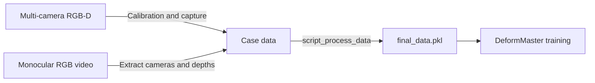

# Data Processing

This directory contains the tools for turning raw RGB-D or monocular RGB
videos into DeformMaster training cases.



## Input Data Preparation

### Multi-Camera RGB-D Capture

Calibrate cameras with calib_frames:

```bash
python data_process/capture_calib_frames.py --output-dir calib_frames/
python data_process/calibrate_charuco.py \
    --pose-dir calib_frames/ \
    --intrinsics calib_frames/intrinsics.json \
    --output calib_frames/calibrate.pkl
```

Record one case:

```bash
python data_process/record_multi_cam.py \
    --output recorded_data/<case_name> \
    --calibrate-pkl calib_frames/calibrate.pkl \
    --frames <N> \
    --start-delay 5 \
    --preview
```

Validate calibration immediately after recording:

```bash
python data_process/verify_multicam_calibration.py \
    recorded_data/<case_name> \
    --per-cam-color
```

Copy or move the recorded case into:

```text
data/different_types/<case_name>/
```

### Monocular Video

Initialize the MoGe2, VGGT-Omega, and Depth Anything 3 Git submodules after
cloning DeformMaster:

```bash
git submodule update --init --recursive
```

Download the gated `vggt_omega_1b_512.pt` checkpoint once and place it at:

```text
data_process/mono_extract_pkg/checkpoints/vggt_omega_1b_512.pt
```

Convert one RGB video into the same case layout:

```bash
python data_process/mono_extract_pkg/scripts/extract_mono_video.py \
    --video data/mono_videos/cloth.mp4 \
    --output_dir data/different_types/my_mono_cloth
```

By default, VGGT-Omega performs temporal reconstruction and MoGe2 provides
metric scale. MoGe2 weights are downloaded on first use.

The extractor creates:

```text
<output_dir>/
  color/0/*.png
  color/0.mp4
  depth/0/*.npy
  calibrate.pkl
  metadata.json
  c2w_sequence.npy
```

Depth arrays are stored as uint16 millimeters. `calibrate.pkl` contains the
frame-0 camera-to-world matrix, while `c2w_sequence.npy` contains the
per-frame camera trajectory.

## Batch Processing

Create a CSV file with no header:

```text
case_name,category,shape_prior,regularize
```

Example:

```bash
cat > configs/data_process/data_config.csv <<'EOF'
case1,cloth,True,True
case2,rope,False,True
EOF
```

Run the processing pipeline:

```bash
xvfb-run -a python data_process/script_process_data.py \
    --config configs/data_process/data_config.csv
```

Useful options:

```bash
--gpus 0,1,2,3        # parallel GPU workers
--gpus ''             # serial mode
--cams 0              # monocular cases
--no-segment          # reuse manual masks (see below Interactive Masks)
--no-overwrite        # keep existing intermediate outputs
```

`xvfb-run -a` is recommended on headless servers because Open3D and PyVista need
an X display for some visualization steps.

## Interactive Masks

If automatic detection (GroundingDINO) fails, guide SAM2 with interactive
point prompts:

```bash
python data_process/interactive_mask_app.py \
    --base_path data/different_types \
    --case_name <case_name> \
    --camera_idx 0 \
    --port 8890
```

Then rerun the batch pipeline with:

```bash
--no-segment
```

Manual masks follow the same output contract as the automatic segmenter:

```text
mask/0/<obj_id>/<frame>.png
mask/metadata.json
```

## Shape Priors

When `shape_prior=True`, the pipeline expects or generates:

```text
<case_name>/shape/object.glb
```

Shape priors come from: TRELLIS

Override or add presets with:

```bash
--shape-prior-preset "KEYWORD:/path/to/object.glb"
```

## Processed Outputs

The processed case contains:

```text
data/different_types/<case_name>/
  final_data.pkl
  split.json
  mask/processed_masks.pkl
  pcd/
  cotracker/
  shape/
  track_process_data.pkl
```

For Track evaluation, manually annotated `gt_track_3d.pkl` and an optional
`gt_track_3d.mp4` visualization can be placed alongside these artifacts. They
are not generated by the preprocessing pipeline.


## Gaussian Data

Export first-frame 3DGS training data:

```bash
python data_process/export_gaussian_data.py --case_name <case_name>
```

The output lives under:

```text
data/gaussian_data/<case_name>/
```

## Before Training

The public release focuses on the online playground and preprocessing flow.
Full training code will be released soon. Before using a processed
case for training in the full codebase:

- Add the case to the appropriate config under `configs/`.
- Confirm `final_data.pkl` and `split.json` exist.
- For Track evaluation only, provide a manually annotated `gt_track_3d.pkl`.
- Inspect point clouds and controller locations.

## Common Issues

| Symptom | Likely cause | Fix |
| --- | --- | --- |
| Empty or noisy point cloud | Bad depth or RGB-depth alignment | Recheck capture and calibration |
| Multi-camera clouds do not overlap | Incorrect extrinsics | Recalibrate cameras |
| Missing controller points | Hand/controller mask failed | Improve recording or use manual masks |
| Shape prior alignment fails | TRELLIS reconstruction is unstable | Retry TRELLIS or disable the shape prior |
| Open3D crashes on a server | No X display | Run with `xvfb-run -a` |
| TRELLIS import/checkpoint errors | Optional dependencies missing | Install optional data-processing stack |
