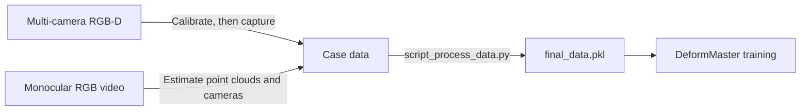

# Data Processing Flow

High-level paths from raw capture to DeformMaster training data.

```mermaid
flowchart LR
    RGBD[Multi-camera RGB-D] -->|Calibrate, then capture| CASE[Case data]
    MONO[Monocular RGB video] -->|Estimate point clouds and cameras| CASE
    CASE -->|script_process_data.py| FINAL[final_data.pkl]
    FINAL --> TRAIN[DeformMaster training]
```
